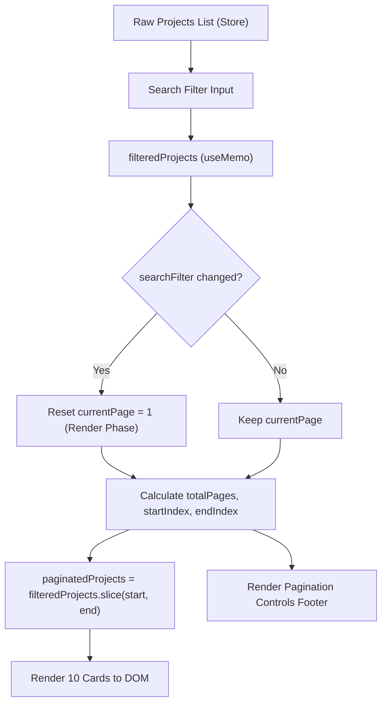

# Pagination Guide & Standards — BPMN Studio

Tài liệu thiết kế, kiến trúc kỹ thuật và tiêu chuẩn triển khai Phân trang (Pagination) cho toàn bộ ứng dụng **BPMN Studio**.

---

## 1. Mục tiêu & Nguyên tắc thiết kế (Objectives & Principles)

1. **Hiệu năng hiển thị (Rendering Performance)**:
   - Giới hạn số lượng bản ghi render đồng thời trên DOM để đảm bảo tốc độ mượt mà 60 FPS, không gây lag khi danh sách dự án hoặc log lớn lên hàng trăm, hàng nghìn bản ghi.
   - Định mức chuẩn: **10 bản ghi / trang** (`DEFAULT_PROJECTS_PAGE_SIZE = 10`).

2. **Tránh Cascading Re-render (React Best Practices)**:
   - Không gọi `setState` đồng bộ bên trong `useEffect` khi người dùng thay đổi bộ lọc tìm kiếm (`searchFilter`).
   - Áp dụng kỹ thuật điều chỉnh state trong quá trình render (Adjusting state during render) theo khuyến nghị chính thức của React.

3. **Tính nhất quán về UI/UX (Design Tokens & Aesthetics)**:
   - Sử dụng các primitive chuẩn từ `@/components/ui/button`.
   - Thiết kế Donezo hiện đại: bo tròn mềm mại (`rounded-xl`, `rounded-2xl`), đường viền tinh tế (`border-border/60`), hiệu ứng shadow nhẹ (`shadow-xs`).
   - Nút trang hiện tại nổi bật bằng `variant="default"`, các nút khác sử dụng `variant="outline"`.

4. **Đa ngôn ngữ nghiêm ngặt (Strict i18n)**:
   - Toàn bộ nhãn, thông số số trang và chỉ báo số lượng bản ghi đều sử dụng `useTranslations("common.table")`.
   - Đồng bộ hoàn toàn giữa tiếng Anh (`en`) và tiếng Việt (`vi`).

---

## 2. Công thức toán học tính toán Phân trang

Cho tập dữ liệu đã lọc gồm $N$ phần tử và kích thước trang $S = 10$:

$$\text{Tổng số trang } T = \max\left(1, \left\lceil \frac{N}{S} \right\rceil\right)$$

$$\text{Trang an toàn } P_{\text{safe}} = \min\left(\max(1, P), T\right)$$

$$\text{Chỉ số bắt đầu (0-indexed) } I_{\text{start}} = (P_{\text{safe}} - 1) \times S$$

$$\text{Chỉ số kết thúc } I_{\text{end}} = \min(I_{\text{start}} + S, N)$$

$$\text{Tập dữ liệu trang hiện tại } = \text{Data}[I_{\text{start}} : I_{\text{end}}]$$

$$\text{Phạm vi hiển thị nhãn người dùng } = [I_{\text{start}} + 1 \rightarrow I_{\text{end}}] \text{ trên tổng số } N$$

---

## 3. Kiến trúc luồng dữ liệu (State Flow Diagram)



---

## 4. Đặc tả giao diện & Trạng thái điều hướng

### 4.1. Thanh điều hướng phân trang (Pagination Footer)

- **Bộ đếm bản ghi (Entry Counter)**:
  - _EN_: `Showing 1 to 10 of 25 entries`
  - _VI_: `Hiển thị 1 đến 10 trên 25 mục`
- **Nút Trang trước (Previous Button)**:
  - Icon `ChevronLeft` kèm nhãn văn bản.
  - Vô hiệu hóa (`disabled`) khi $P_{\text{safe}} \le 1$.
- **Cụm số trang (Page Numbers)**:
  - Hiển thị trang đầu (1), trang cuối ($T$) và các trang lân cận trang hiện tại ($\pm 1$).
  - Thu gọn các khoảng trống bằng dấu ba chấm `…` không click được.
  - Trang đang chọn có nền `primary` (`variant="default"`).
- **Nút Trang sau (Next Button)**:
  - Icon `ChevronRight` kèm nhãn văn bản.
  - Vô hiệu hóa (`disabled`) khi $P_{\text{safe}} \ge T$.

---

## 5. Từ điển i18n liên quan (`common.json`)

Cả 2 tệp `i18n/locales/en/common.json` và `i18n/locales/vi/common.json` đều cung cấp các khóa chuẩn:

| Key                    | English (`en`)                                | Tiếng Việt (`vi`)                             | Mô tả                     |
| ---------------------- | --------------------------------------------- | --------------------------------------------- | ------------------------- |
| `table.showingEntries` | `Showing {start} to {end} of {total} entries` | `Hiển thị {start} đến {end} trên {total} mục` | Chỉ báo khoảng bản ghi    |
| `table.pageOf`         | `Page {current} of {total}`                   | `Trang {current} / {total}`                   | Tỷ lệ trang               |
| `table.prevPage`       | `Previous page`                               | `Trang trước`                                 | Nút lùi 1 trang           |
| `table.nextPage`       | `Next page`                                   | `Trang sau`                                   | Nút tiến 1 trang          |
| `table.rowsPerPage`    | `Rows per page`                               | `Số hàng mỗi trang`                           | Tùy chọn kích thước trang |

---

## 6. Triển khai tham chiếu (Reference Implementation)

### 6.1. Component nguyên tử `Pagination` (`components/ui/pagination.tsx`)

Thành phần UI độc lập, có thể tái sử dụng ở bất kỳ danh sách hay bảng dữ liệu nào:

```tsx
import { Pagination } from "@/components/ui/pagination";

<Pagination
  currentPage={currentPage}
  totalItems={totalProjects}
  pageSize={10}
  onPageChange={(page) => setCurrentPage(page)}
  showEntriesCount={true}
/>;
```

### 6.2. Custom Hook `usePagination` (`hooks/utils/use-pagination.ts`)

Hook quản lý state phân trang tập trung, hỗ trợ tự động reset trang khi filter thay đổi:

```tsx
import { usePagination } from "@/hooks";

const {
  currentPage,
  pageSize,
  totalItems,
  totalPages,
  startIndex,
  endIndex,
  paginatedItems,
  setPage,
  nextPage,
  prevPage,
  canNextPage,
  canPrevPage,
} = usePagination({
  items: rawOrFilteredList,
  pageSize: 10,
  resetDependency: searchFilter, // Tự động về trang 1 khi filter thay đổi
});
```

### 6.3. Tích hợp trong `RecentProjectsList` (`components/home/recent-projects-list.tsx`)

```tsx
"use client";

import { useMemo } from "react";
import { usePagination } from "@/hooks";
import { Pagination } from "@/components/ui/pagination";
import { DEFAULT_PROJECTS_PAGE_SIZE } from "@/constants";

export function RecentProjectsList({
  projects,
  searchFilter = "",
  pageSize = DEFAULT_PROJECTS_PAGE_SIZE,
}: RecentProjectsListProps) {
  const filteredProjects = useMemo(() => {
    return projects.filter((p) => p.name.toLowerCase().includes(searchFilter.toLowerCase()));
  }, [projects, searchFilter]);

  // Sử dụng hook usePagination tái sử dụng
  const {
    currentPage,
    totalItems,
    paginatedItems: paginatedProjects,
    setPage,
  } = usePagination({
    items: filteredProjects,
    pageSize,
    resetDependency: searchFilter,
  });

  return (
    <div className="rounded-2xl bg-card border border-border/80 p-5 shadow-xs flex flex-col gap-4">
      {/* 10 bản ghi hiện tại */}
      <div className="flex flex-col gap-2.5">
        {paginatedProjects.map((p) => (
          <ProjectItem key={p.id} project={p} />
        ))}
      </div>

      {/* Component Pagination tái sử dụng */}
      <Pagination
        currentPage={currentPage}
        totalItems={totalItems}
        pageSize={pageSize}
        onPageChange={setPage}
      />
    </div>
  );
}
```

---

## 7. Quy tắc bảo trì & mở rộng (Maintenance Rules)

1. **Hằng số tập trung**: Luôn sử dụng `DEFAULT_PROJECTS_PAGE_SIZE` từ `@/constants` (tránh sử dụng magic number `10` rải rác).
2. **Kích thước tệp (< 500 dòng)**: Giữ các tệp component chứa phân trang dưới 500 dòng code. Khi phân trang trở nên phức tạp với nhiều dropdown chọn kích thước trang, hãy tách thành component nguyên tử `components/ui/pagination.tsx`.
3. **Kiểm thử biên (Boundary Testing)**:
   - Danh sách rỗng ($N = 0$): Ẩn footer phân trang, hiển thị empty state.
   - Số lượng bản ghi $< 10$: Hiển thị danh sách và số lượng mục, ẩn các nút Prev/Next và số trang.
   - Số lượng bản ghi $= 10$: Hiển thị 1 trang duy nhất, ẩn nút chuyển trang.
   - Số lượng bản ghi $> 10$: Hiển thị phân trang đầy đủ, tự động phân phối 10 bản ghi mỗi trang.
