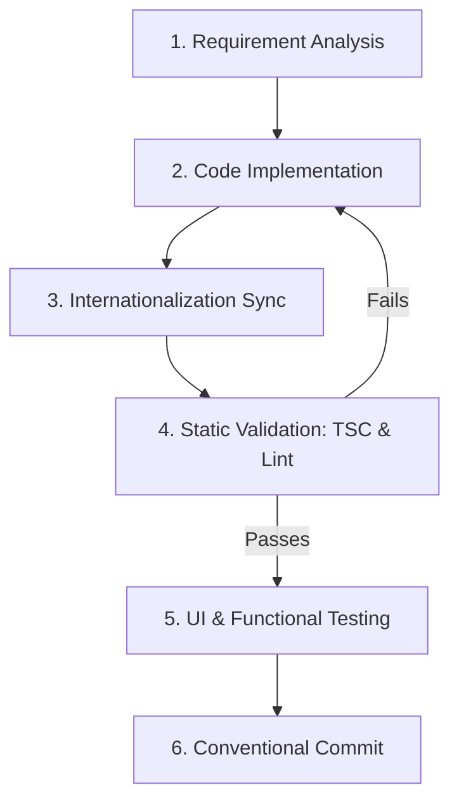

# Development & Collaboration Workflow

This document describes the workflow for developing, testing, verifying, and committing changes in the **Cycle Time Studio** repository.

---

## 1. Development Lifecycle



---

## 2. Step-by-Step Workflow

### Step 1: Requirement Analysis

- Identify which subsystems are involved:
  - Calculation Engine (`lib/engine.ts`)
  - State & History (`lib/store/useEditorStore.ts`)
  - Diagram Subsystem (`lib/graph.ts`, `lib/bpmn.ts`, `components/diagram/`)
  - UI & Parameters (`components/editor/`, `components/ui/`)
- Check existing type definitions in `types/` before adding new structures.

### Step 2: Implementation & Encapsulation

- Place UI components in their appropriate modular folder.
- Ensure all parent barrels (`index.ts`) export the new component.
- Keep components focused and single-purpose.

### Step 3: Internationalization (i18n) Synchronization

- Whenever adding new UI elements, define keys in both:
  - `i18n/locales/en/*.json`
  - `i18n/locales/vi/*.json`
- Access via `useTranslations(namespace)`.

### Step 4: Static Verification (MANDATORY)

Run the following commands before completing any task:

```bash
# 1. Type check
npx tsc --noEmit

# 2. ESLint check
npx eslint .

# 3. Code formatting
npm run format
```

### Step 5: Functional & Diagram Verification

- Verify that changes in the block model properly update:
  - Total expected cycle time and formula.
  - Timesheet usage count badges.
  - BPMN auto-layout and React Flow node graph.
  - Diagram Inspector fields and node highlights.
  - Monte Carlo histogram.
  - Undo/Redo history stack.

### Step 6: Commit Conventions

Commits are validated with Commitlint and Husky:

- `feat:` A new user-facing feature.
- `fix:` A bug fix or error resolution.
- `refactor:` Code restructuring without changing external behavior.
- `docs:` Documentation updates.
- `style:` Formatting, missing semicolons, etc.
- `chore:` Build scripts, package updates, configuration changes.

Example:

```bash
git commit -m "feat(diagram): add interactive diagram inspector for direct node editing"
```

---

## 3. Git Files Matrix (What to Push vs. What NOT to Push)

### ✅ What MUST Be Pushed to Git

1. **Source Code**:
   - `app/`, `components/`, `containers/`, `lib/`, `hooks/`, `types/`, `constants/`, `utils/`, `public/`.
2. **Translation Dictionaries**:
   - `i18n/locales/en/*.json` and `i18n/locales/vi/*.json`.
3. **Project Documentation & Rules**:
   - `README.md`, `AGENTS.md`, `CLAUDE.md`, `docs/` (`ARCHITECTURE.md`, `RULES.md`, `WORKFLOW.md`).
4. **Configuration & Tooling Files**:
   - `package.json`, `pnpm-lock.yaml` (or `package-lock.json`).
   - `tsconfig.json`, `next.config.ts`, `next-env.d.ts`, `postcss.config.mjs`, `components.json`.
   - `.gitignore`, `.prettierrc.json`, `.prettierignore`, `eslint.config.mjs`, `commitlint.config.cjs`, `.husky/`.

### ❌ What MUST NEVER Be Pushed to Git (Configured in `.gitignore`)

1. **Dependencies**: `node_modules/`
2. **Build Outputs & Bundles**: `.next/`, `out/`, `build/`, `dist/`
3. **Cache & Diagnostics**: `*.tsbuildinfo`, `*.log`, `coverage/`
4. **Environment Secrets & API Keys**: `.env`, `.env*.local` (only push `.env.example` if needed)
5. **OS Temporary Files**: `.DS_Store`, `Thumbs.db`
6. **IDE / AI Agent Scratchpads**: `.gemini/`, `.claude/`, `scratch/`, `.idea/`, local `.vscode/` configs
